# Azure DevOps Notes

## Creating project
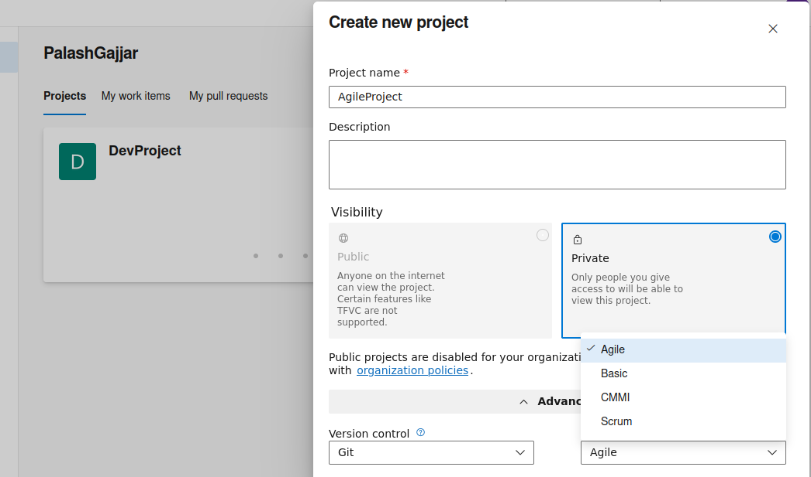

## Creating Epic
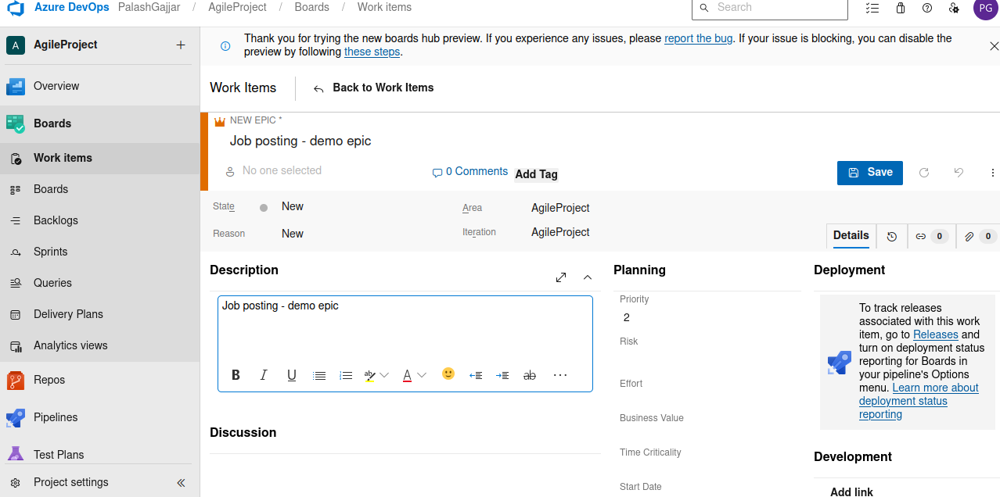

## Assigning Child to Epic
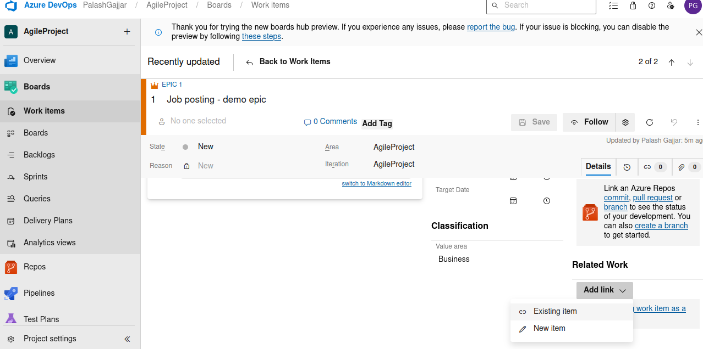
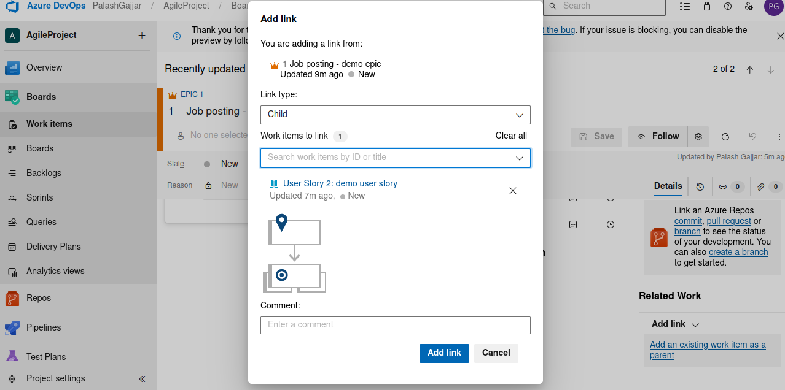

## Creating Task
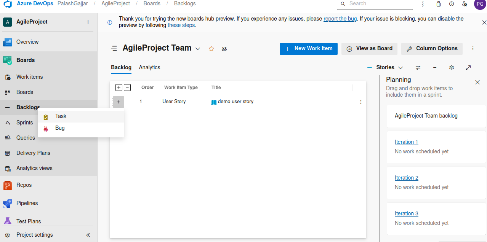

## Creating Sprints
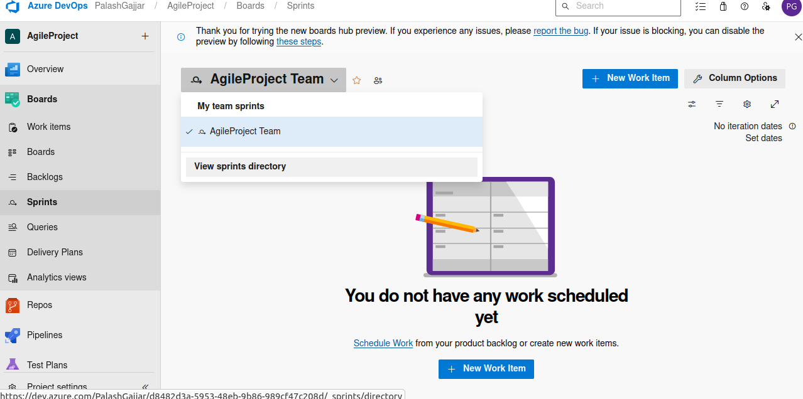

-   click on set date to make changes

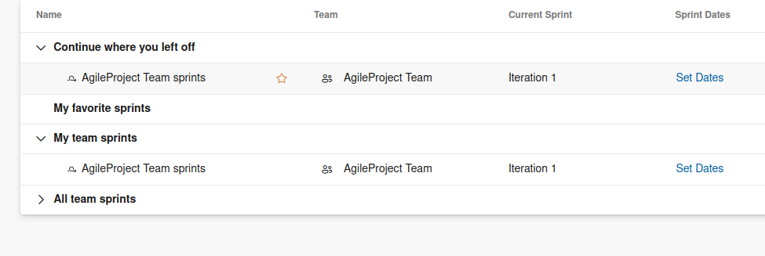

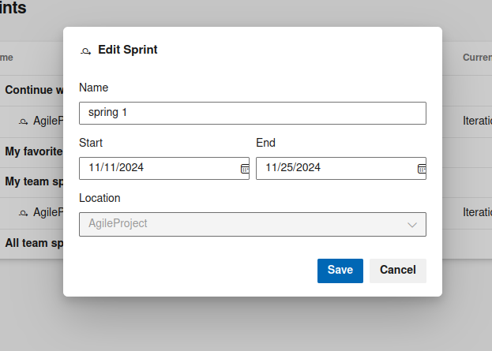

## Associating Sprints with tasks

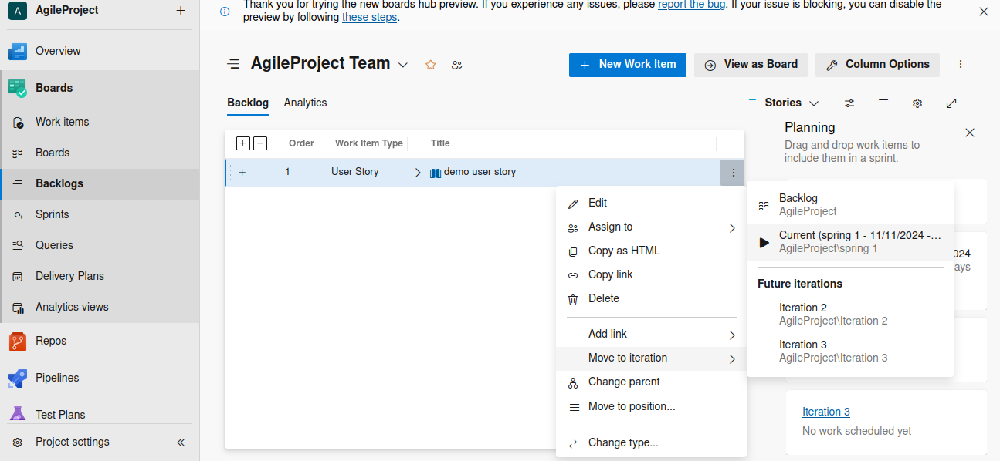

## Creating Dashborads

-   click on add widgets
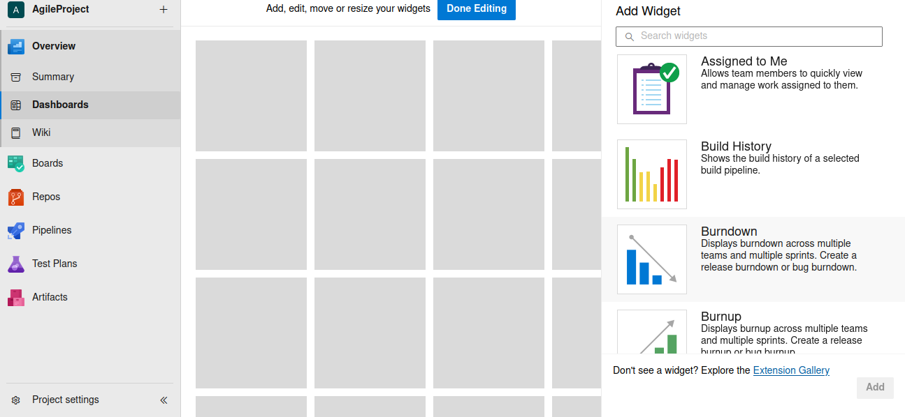

## Query

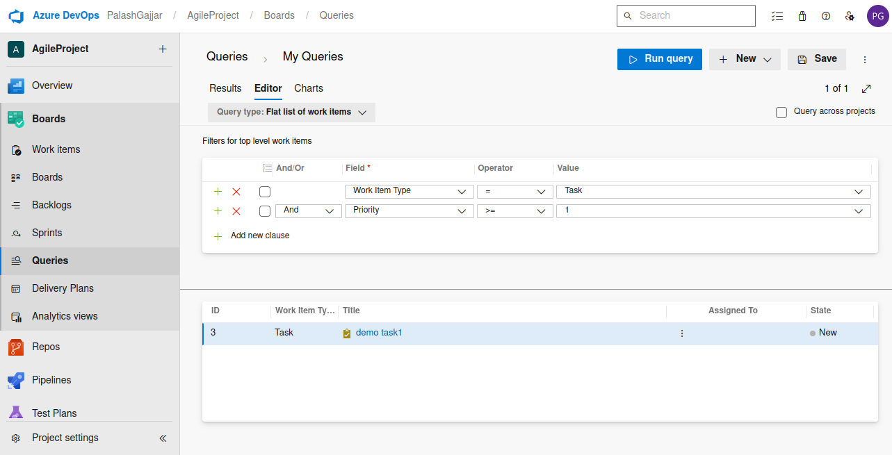

## Create chart from Query

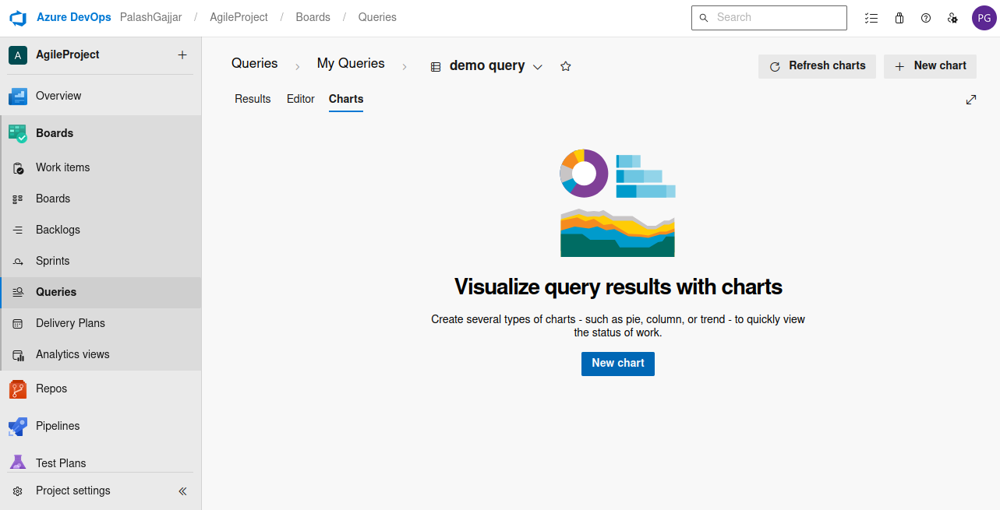
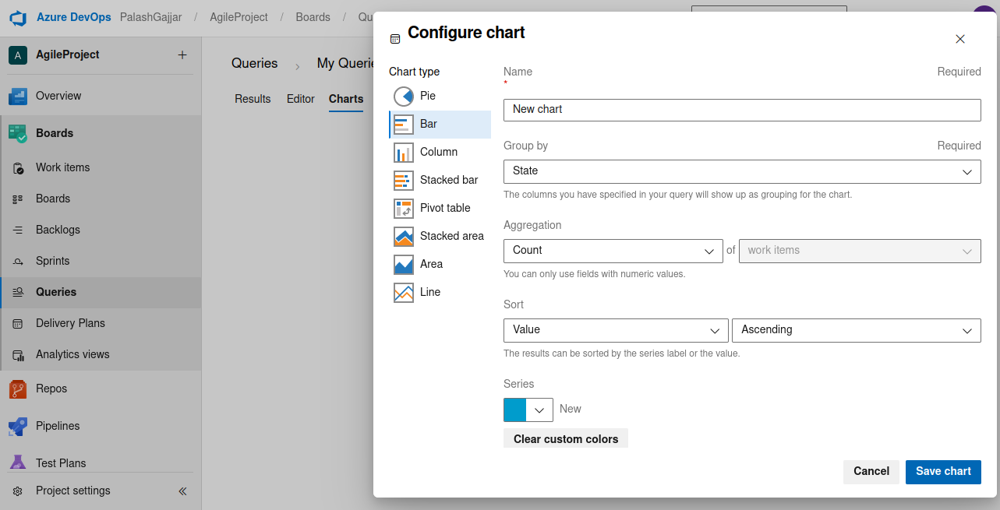
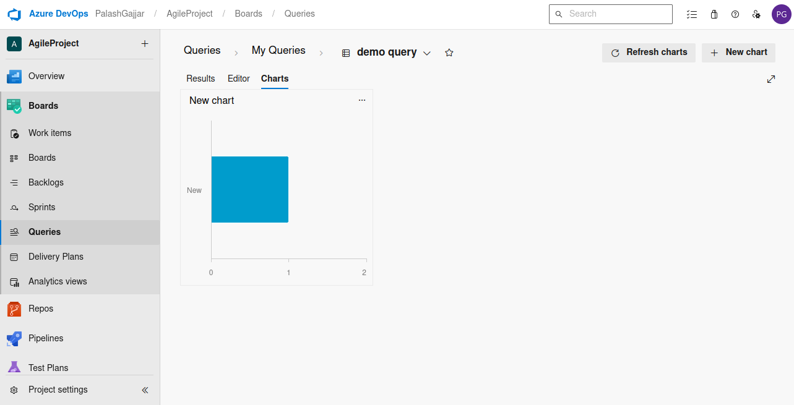

#### To be able to add chart to dashboard it query needs to be stored in shared folder. 

## Access Levels 

### Basic

-   Provides basic features of azure devops but exculdes azure test plans.

### Basic+Test

-   Gives acces to basic + test plan

### Stakeholder

-   Gives free access but has limitations. Limiterd acces to boards and pipeline. No access to code repo.

### Visual studio

-   It depends upon the subscription of your VS assigned.

## Check and Assign Permission

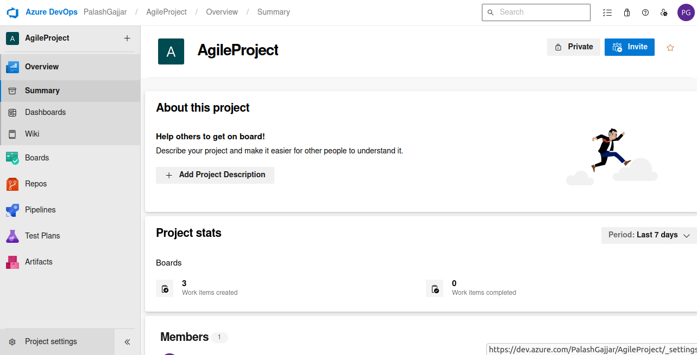
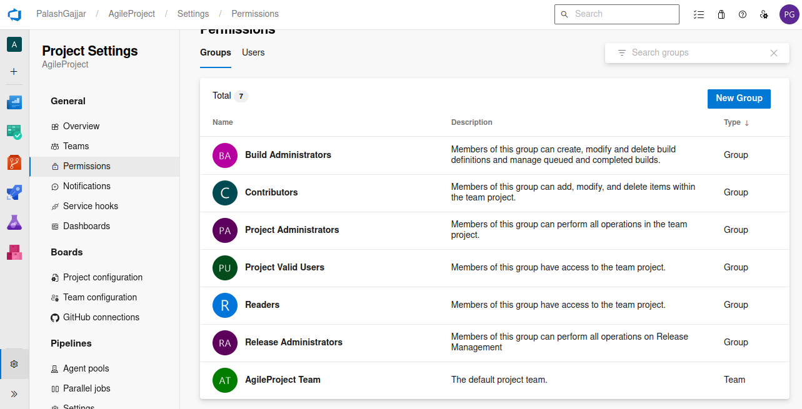

### Modifying Permissions

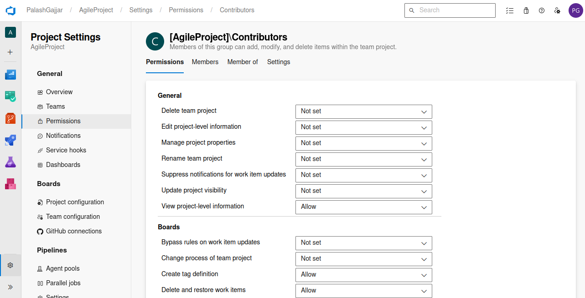

## Creating Wiki

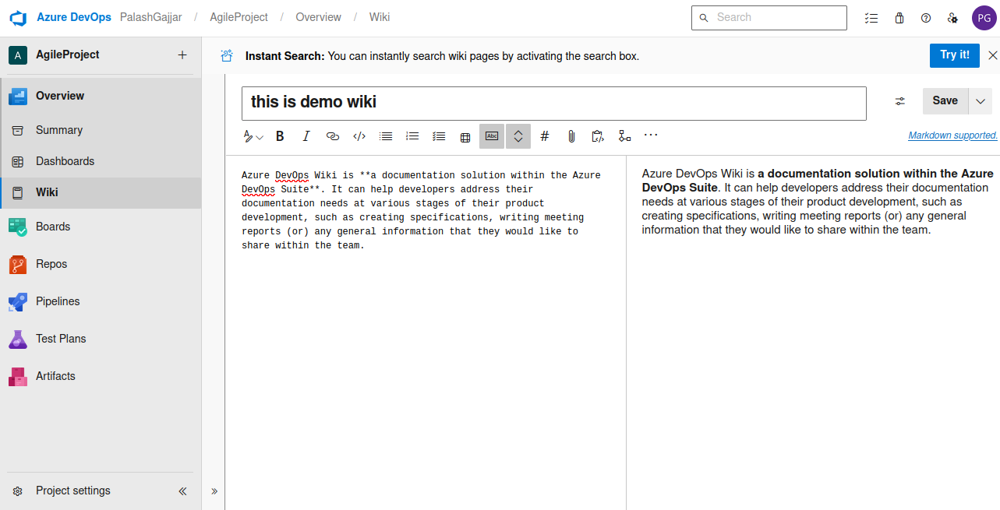
### Add Sub page

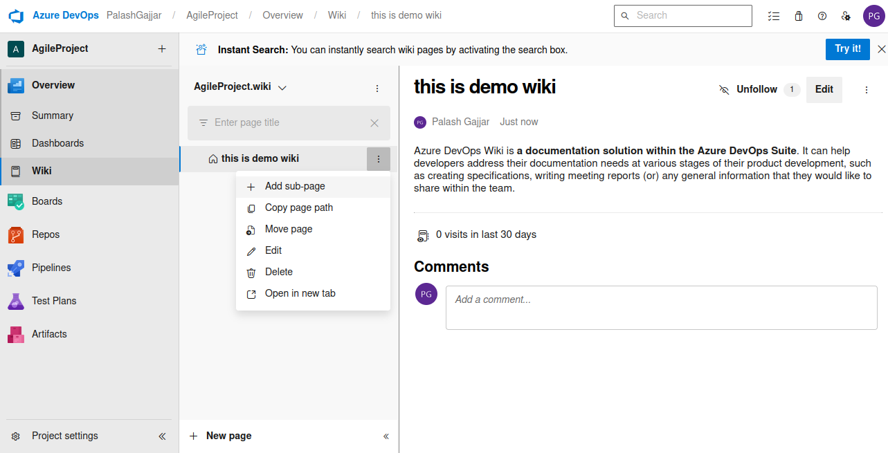

## Create delivery Plan

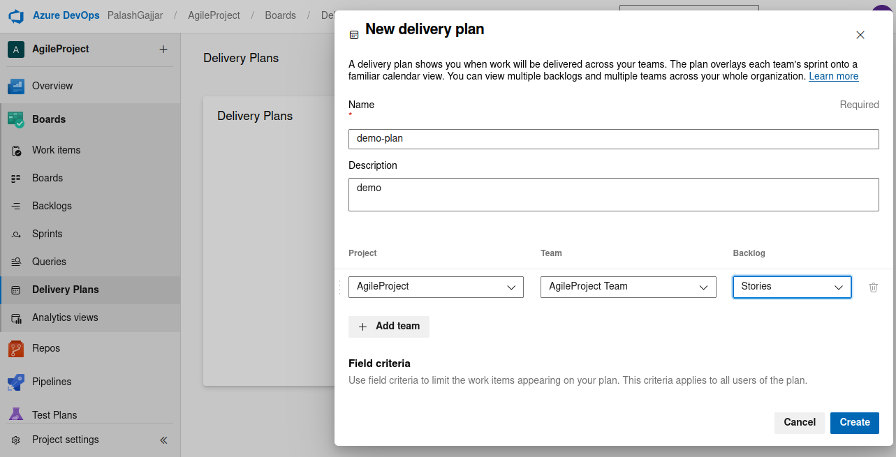
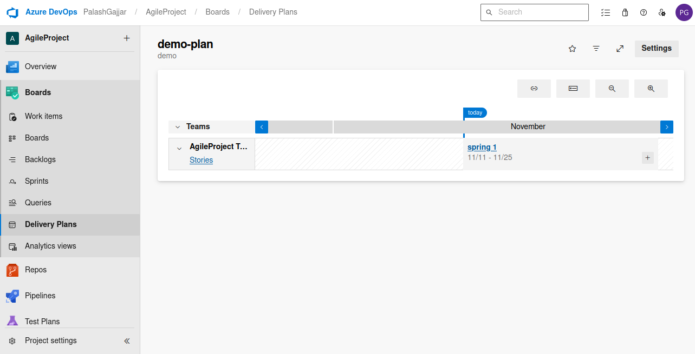