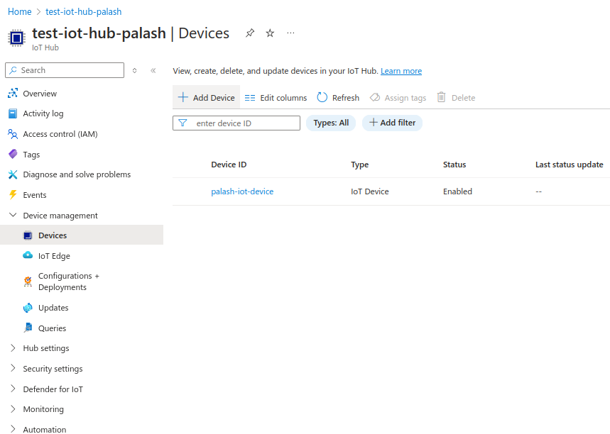
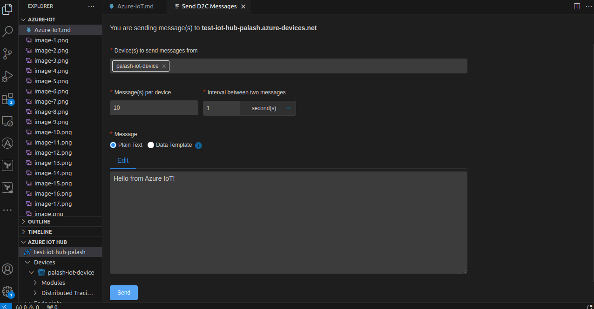

# Azure IoT

## Azure IoT Explorer Installation Refs

```
https://github.com/Azure/azure-iot-explorer/releases
```
```
https://learn.microsoft.com/en-us/azure/iot/howto-use-iot-explorer
```

-   If installing a deb package then

```
sudo gdebi azure-iot-explorer_0.15.11_amd64.deb
```

-   Then Launch it

## Creating IoT Hub


## Adding Device



## Creating a Device


## Connecting rasspberry IoT simulator with iot device

#### Raspberry Web Simulator
```
https://azure-samples.github.io/raspberry-pi-web-simulator/
```

#### Copy the connection string


#### Replace the connection string with actual connection string 


#### Open azure explore and configure connection string here


#### Get Connection string from here


#### Start telemetory


#### Create Event Hub Namespcae


#### Create Event Hub


#### Configuring Event Hub 


-   Add Primary connection string of sas policy created to endpoint in iot explorer


#### Send D2C Messages to IoT Hub using VsCode

-   view Azure Azure iot hub in bottom left, click on tree dots.
-   Then select send D2C Messages to IoT Hub using VsCode




