# Azure

## Web App-Task

-   Creating Web App Service resourse

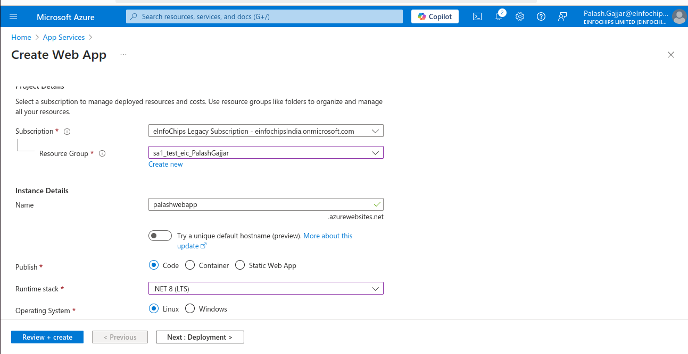

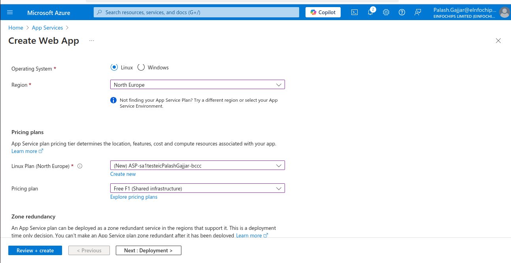

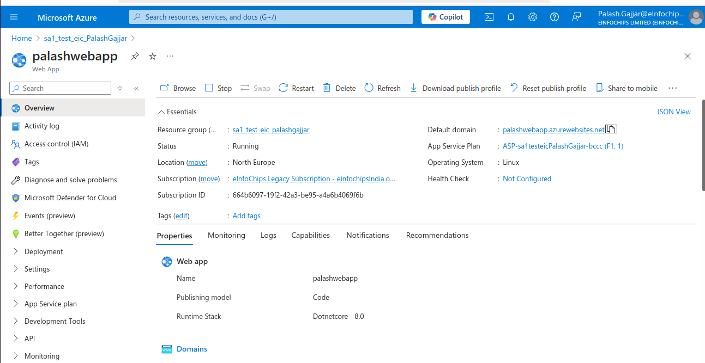

-   Testing the URL

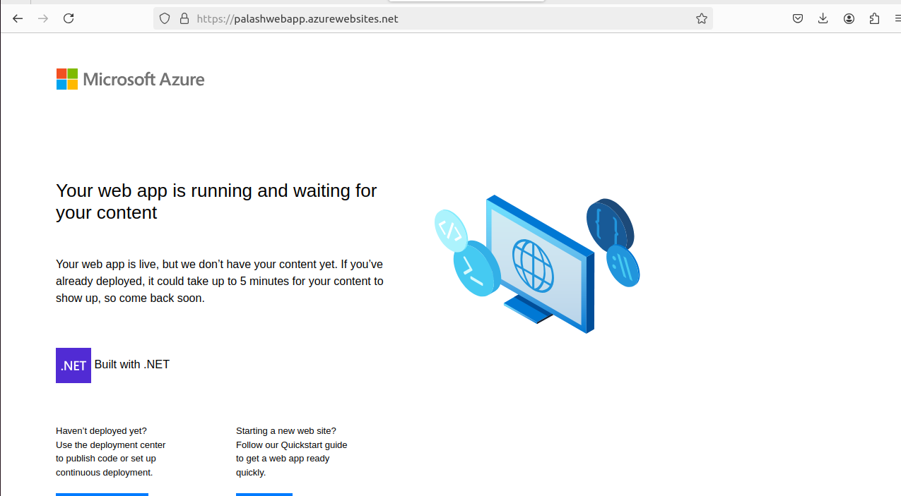

-   Now, go into Developer Tools and over there go into App service editor.

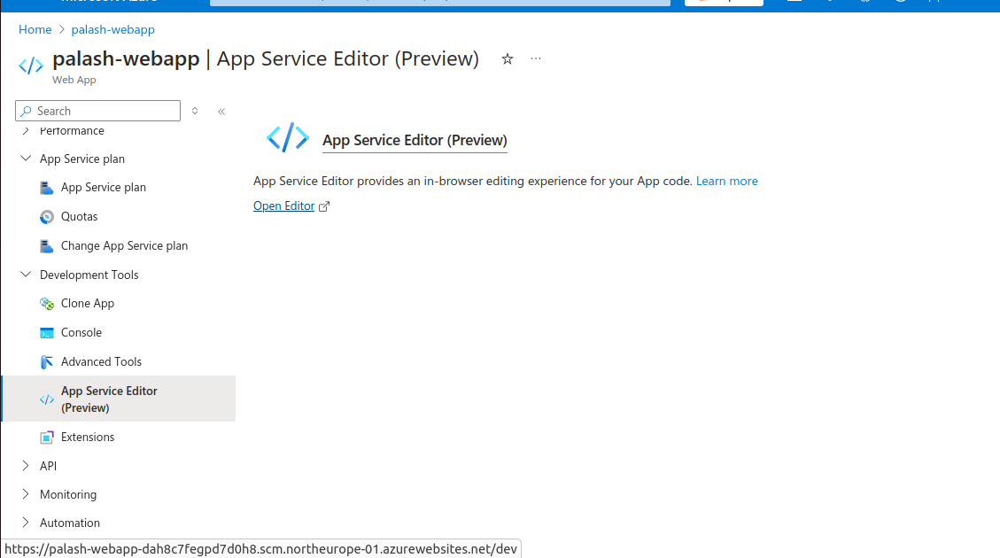

-   Add your code over here

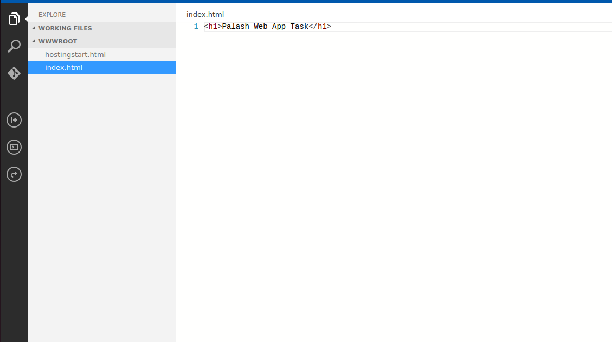

-   Final testing

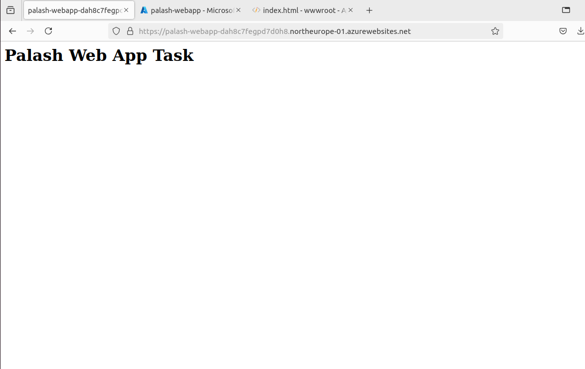

## Container Registory-Task

-   Create container registory
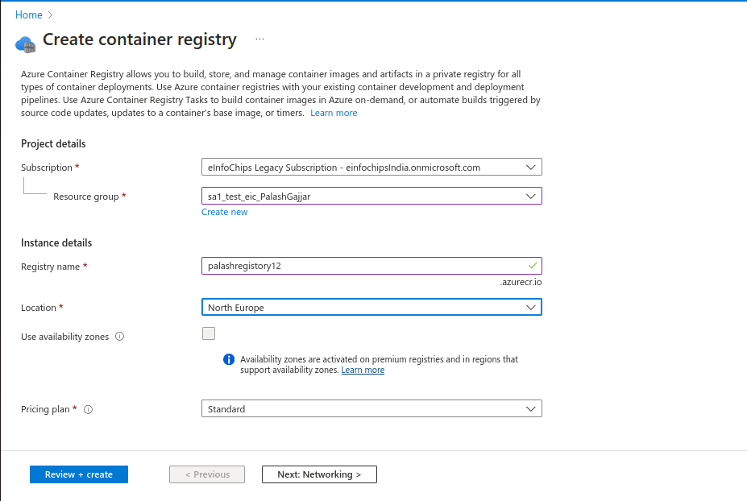

-   login into docker using Azure container registory credentials, which we can get from access Token section.

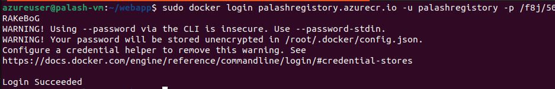

-   building image

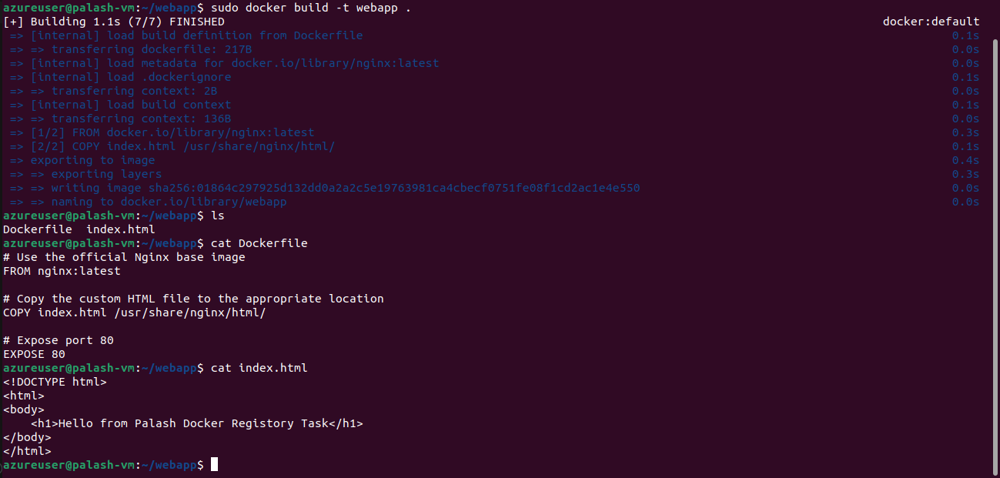

-   push image to azure registory

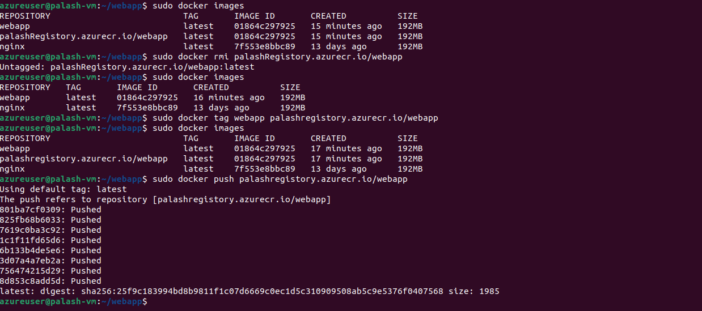

-   Checking the registory if we have our image present over there.

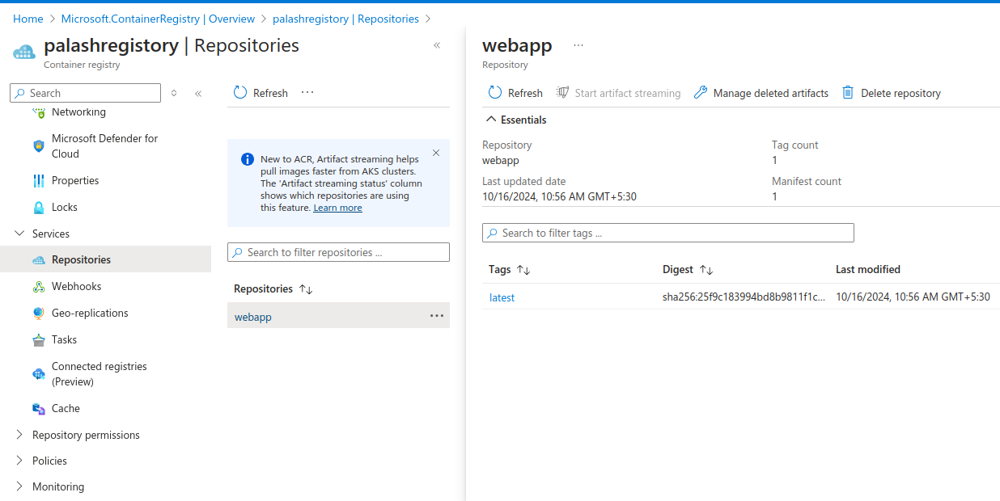

-   pulling and running the image from azure registory

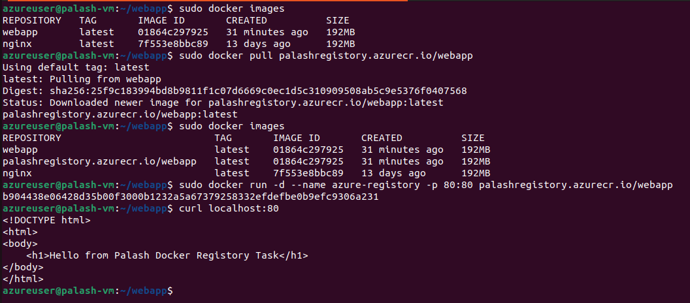

-   running container output

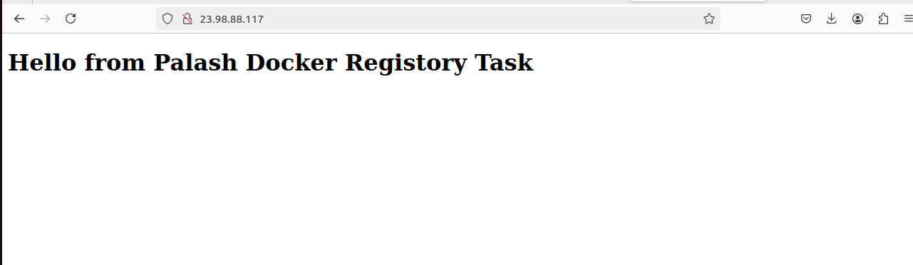